# laravel-ai-price-intelligence-admin

[](https://www.php.net/)
[](https://laravel.com/)
[](https://react.dev/)
[](https://vitejs.dev/)
[](https://tailwindcss.com/)
[](https://github.com/padosoft/laravel-ai-price-intelligence-admin/actions)
[](LICENSE)

> **The web admin panel for [`padosoft/laravel-ai-price-intelligence`](https://github.com/padosoft/laravel-ai-price-intelligence)** —
> a React 19 + TypeScript single-page app that turns the core's REST API into a fast, accessible,
> EU-compliant competitor-monitoring cockpit. **This is the self-hostable panel Netrivals and
> Competitoor don't give you.**

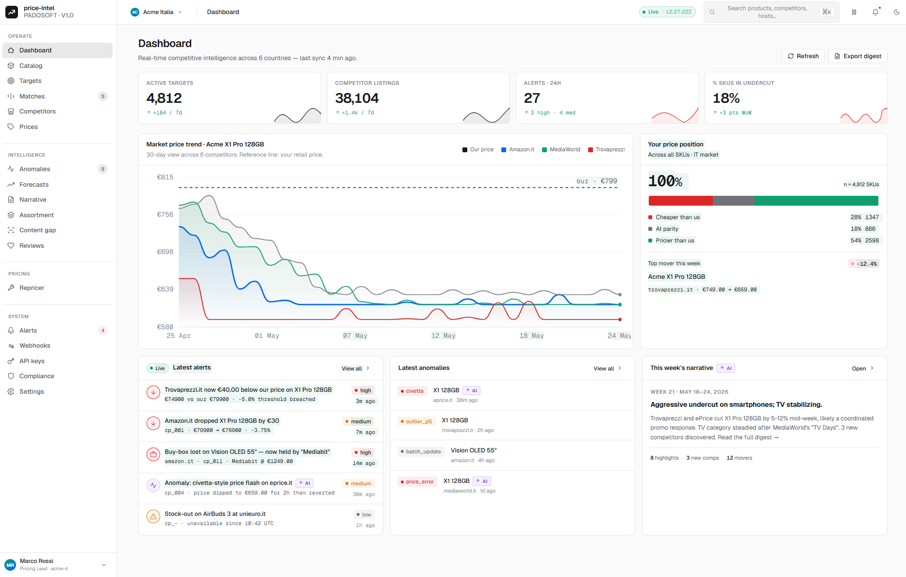

---

## Table of Contents

- [Highlights](#highlights)
- [Screens](#screens)
- [Tech stack](#tech-stack)
- [Quick start](#quick-start)
- [Built for scale (500k SKU)](#built-for-scale-500k-sku)
- [How it talks to the core](#how-it-talks-to-the-core)
- [Real-time alerts (SSE + polling fallback)](#real-time-alerts-sse--polling-fallback)
- [Internationalisation](#internationalisation)
- [Accessibility & theming](#accessibility--theming)
- [Testing](#testing)
- [License](#license)

---

## Highlights

- **19 screens** covering the full workflow — catalog, monitoring targets, AI match review,
  competitors, price explorer, anomalies, forecasts, weekly narrative, assortment & content gaps,
  review sentiment, repricer, alerts, webhooks, API keys, compliance and settings.
- **Built for very large catalogs (≈500k SKU)** — cursor-paginated **infinite scroll** + **table
  virtualization** (`@tanstack/react-virtual`) so lists render thousands of rows smoothly with a
  bounded DOM; **exact facet chips** (host & brand) computed server-side in SQL, never from a loaded
  page; streamed CSV export of the full dataset. See [Built for scale](#built-for-scale-500k-sku).
- **Fully interactive — no dead buttons** — every action hits a real endpoint: create
  targets/SKUs/rules/webhooks, import CSV, add-by-URL, trigger discovery/scrape, acknowledge
  anomalies (single + bulk), edit tenant settings, simulate repricing, export — all with validated
  forms and **optimistic updates + rollback**.
- **Resilient real-time** — a single Server-Sent-Events subscription (`/alerts/stream`) streams new
  alerts into every open screen; where SSE can't be used (bearer/headless) it **degrades gracefully
  to interval polling**. The live-pill shows Live / Polling / Reconnecting.
- **AI-transparent** — every AI-generated output (matches, forecasts, narrative, sentiment) carries
  an `AI` badge; the Compliance screen surfaces the **EU AI Act decision log** (Art. 12 record-keeping)
  the core logs.
- **WCAG AA & dark mode** — AA-contrast tokens, keyboard-accessible controls (incl. focusable
  virtualized scroll regions), `aria-*` state on every toggle, and a first-class dark theme. Axe runs
  in CI on every screen.
- **IT / EN** — i18next-powered, switchable from the top bar; the host injects the tenant's locale.
- **Typed end-to-end** — a hand-written TypeScript mirror of the core v1.x API, TanStack Query for
  caching/mutations/infinite-scroll, and a dev mock layer so the panel runs with zero backend.
- **Feature-gated** — Reviews, Repricer and Compliance appear only when the tenant has the matching
  core feature flag (`GET /tenants/me`).

## Screens

| Dashboard (dark) | AI match review | Competitors |
|---|---|---|
| 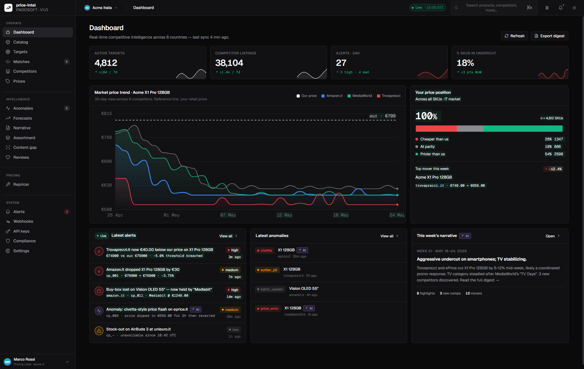 | 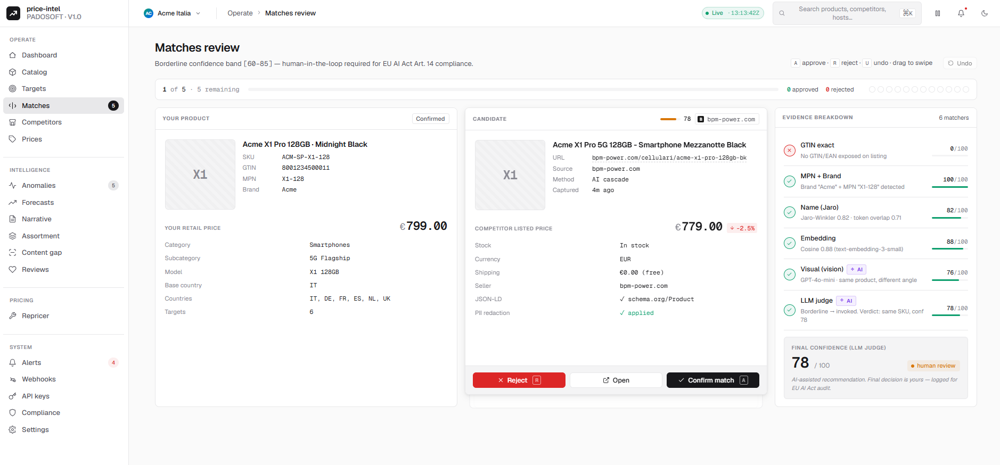 | 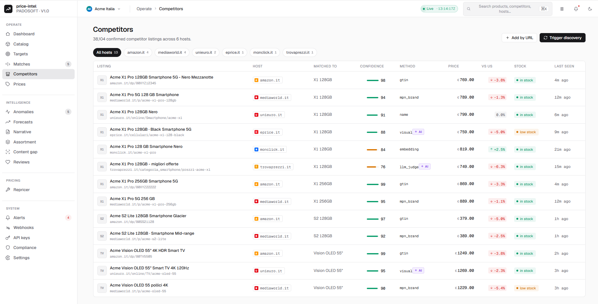 |

| Price explorer | Anomaly detection | Price forecasts |
|---|---|---|
| 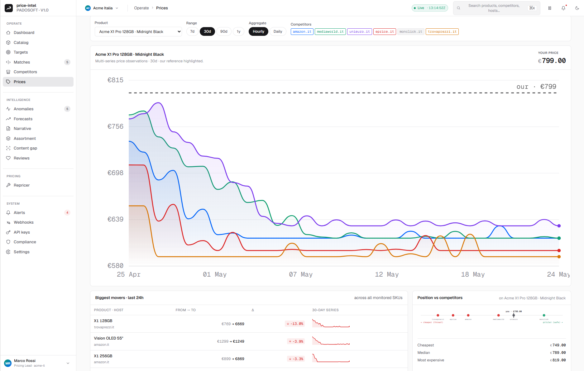 | 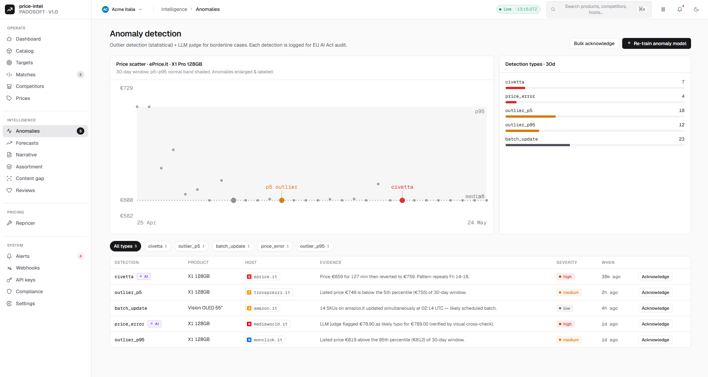 | 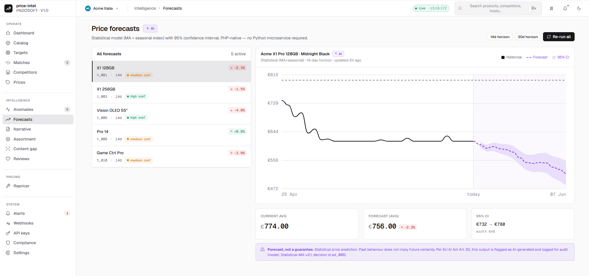 |

| Weekly AI narrative | Assortment gaps (treemap) | Content gap analysis |
|---|---|---|
| 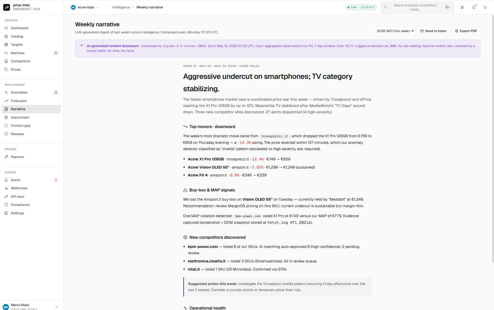 | 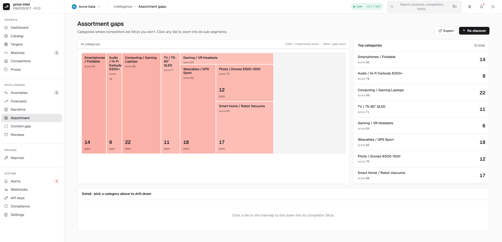 | 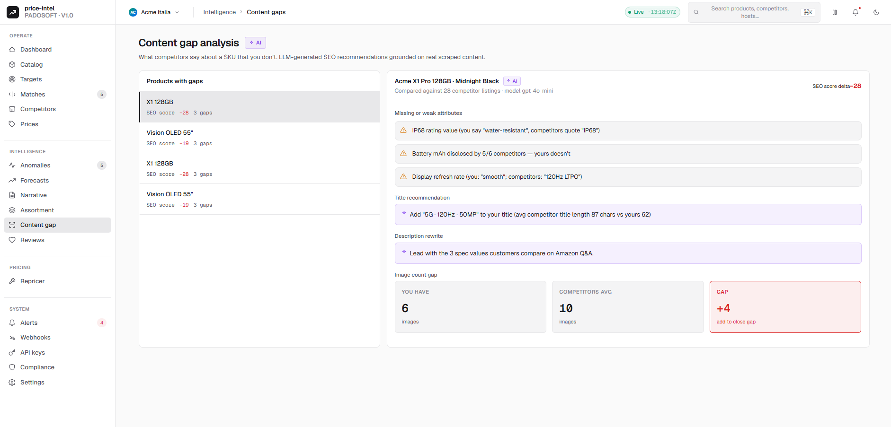 |

| Review insights (GDPR-safe) | Repricer (advisory) | EU AI Act compliance |
|---|---|---|
| 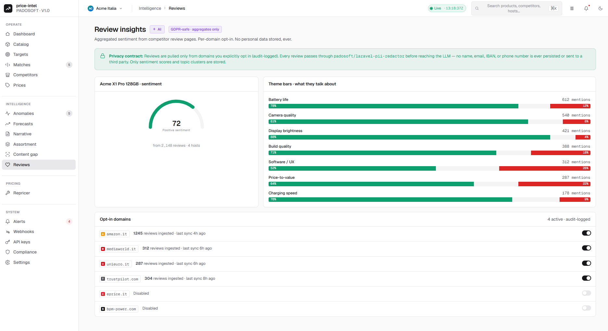 | 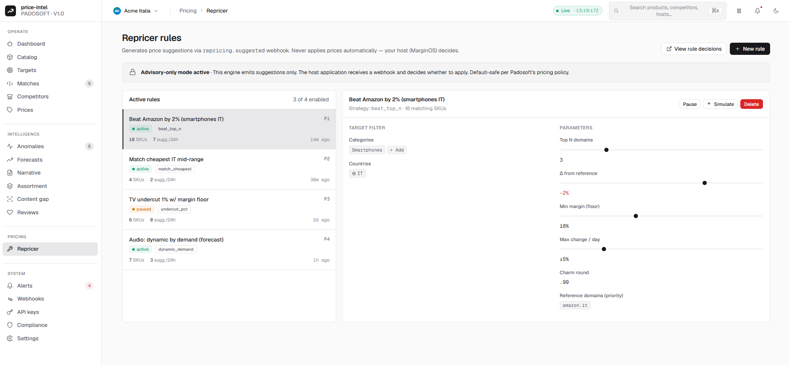 | 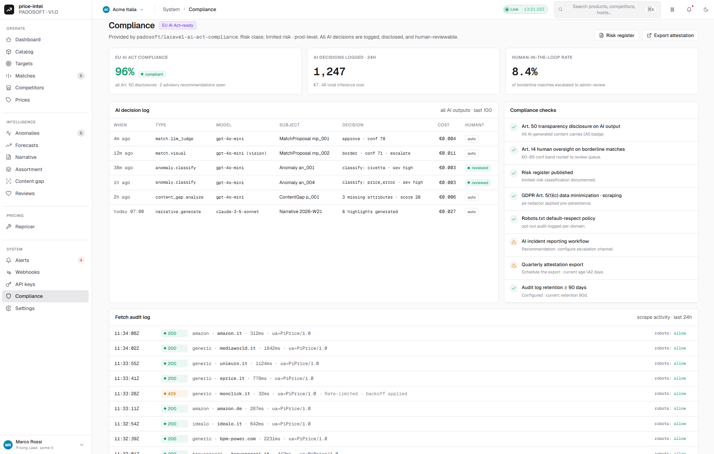 |

| Alerts inbox | Webhooks | API keys |
|---|---|---|
| 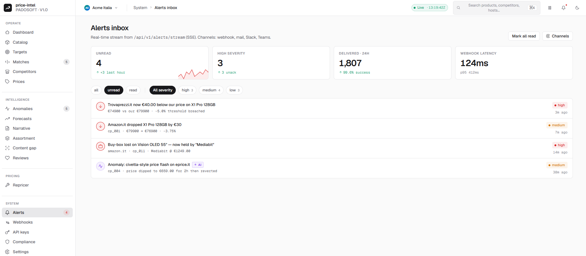 | 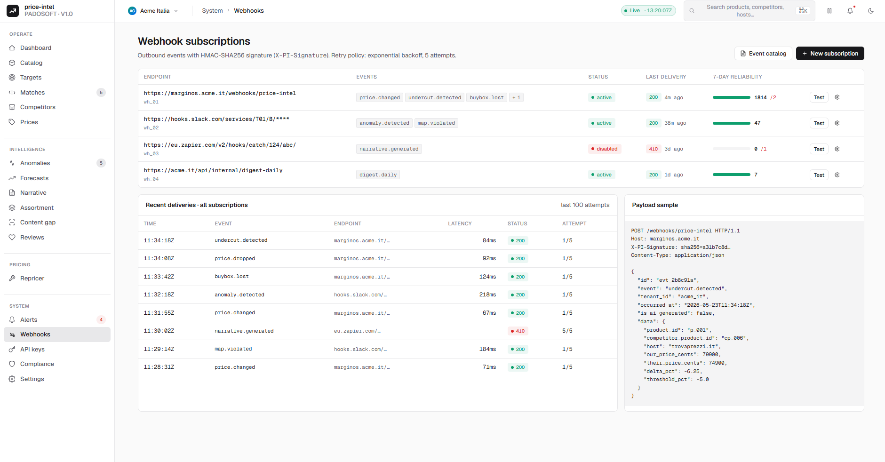 | 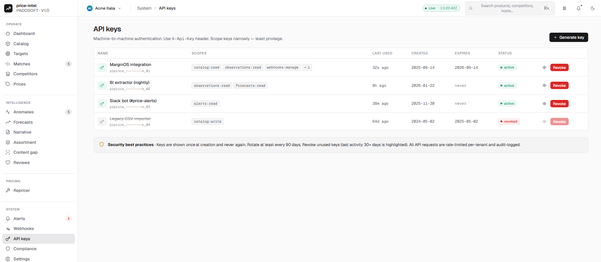 |

<details>
<summary>More screens</summary>

- [Catalog](screenshoots/laravel-ai-price-intelligence-Web-Panel-catalog.png) ·
  [Competitor detail — price](screenshoots/laravel-ai-price-intelligence-Web-Panel-catalog-detail-price.png) ·
  [— stock](screenshoots/laravel-ai-price-intelligence-Web-Panel-catalog-detail-stock.png) ·
  [— promo](screenshoots/laravel-ai-price-intelligence-Web-Panel-catalog-detail-promo-details.png)
- [Targets](screenshoots/laravel-ai-price-intelligence-Web-Panel-targets.png) ·
  [Settings](screenshoots/ai-price-intelligence-settings.png)

</details>

## Tech stack

React 19 · TypeScript · Vite · Tailwind CSS 4 · TanStack Query 5 · i18next · custom SVG charts ·
Lucide icons · Vitest · Playwright (+ `@axe-core/playwright`). PHP side: a thin Laravel service
provider serving the built SPA behind a Sanctum-authenticated, `EnsureAdmin`-gated route.

## Quick start

```bash
# Install JS + PHP deps
npm install
composer install

# Dev server (uses the in-app mock layer — no backend required)
npm run dev

# Quality gates
npm run typecheck && npm run lint && npm run test && npm run build
npm run e2e             # Playwright + axe against the built preview
```

Mount it from your host app by `composer require padosoft/laravel-ai-price-intelligence-admin`; the
service provider publishes the panel and the runtime config (`apiBaseUrl`, `auth.mode`, `locale`,
`realtime.driver`) is injected by the Blade wrapper.

## Built for scale (500k SKU)

The panel is engineered to stay fast on enterprise catalogs, where the list endpoints return
hundreds of thousands of rows:

- **Cursor pagination + infinite scroll** — Catalog and Competitors use TanStack
  `useInfiniteQuery` following the core's `next_cursor`; pages load on demand as you scroll.
- **Table virtualization** — a reusable `VirtualTable` (`@tanstack/react-virtual`) renders only the
  visible window of rows (spacer-row technique, so `<table>` semantics and styling are preserved),
  keeping the DOM bounded no matter how long the list is. The scroll region is keyboard-focusable.
- **Server-side facets** — host and brand chips come from SQL-computed facet endpoints
  (`GET /facets/hosts`, `GET /facets/brands`): exact counts over the whole table, not a count of the
  first page. Brand/host filters are applied server-side so filtering scales too.
- **Streamed export** — CSV export hits the core's streamed `:export` endpoints (OOM-safe on the
  server), not an in-memory dump.
- **Bounded caches** — the live alert stream prepends and caps the cached first page; full history
  stays reachable by cursor.

This mirrors the core's big-data design (DB-level facets/aggregates, cursor pagination, streamed
export, monthly-partitioned time-series + daily aggregates).

## How it talks to the core

The panel is a pure consumer of the core's `/api/v1` REST API. A typed `api` client (cookie +
`X-XSRF-TOKEN` in SPA mode, or `Bearer` headless) wraps `fetch`, maps RFC-7807 problem+json errors,
and feeds TanStack Query hooks (`useCatalog`, `useCatalogInfinite`, `useMatches`, `useCompetitors`,
`useForecasts`, `useRules`, …) plus mutation hooks with optimistic updates + rollback. CSV imports
go up as multipart `FormData`; streamed CSV exports come back as a blob download. In dev/test a mock
layer (`useMocks`) serves fixtures so the UI renders with no backend; in production those same hooks
hit the live core.

## Real-time alerts (SSE + polling fallback)

`AlertStreamProvider` resolves a single live-alert transport for the whole app:

- **`sse`** (primary, cookie SPA mode) — one `EventSource` to `GET /api/v1/alerts/stream`, listening
  for the core's named `alert` events and prepending them into the cached alert pages, so the inbox
  and dashboard update live.
- **`polling`** (fallback) — when SSE can't be used (bearer/headless auth, since `EventSource` can't
  send a Bearer header, or no `EventSource`), it falls back to an interval refetch of `['alerts']`
  (cadence `realtime.pollIntervalMs`, default 15s, floored to 1s) so "live" degrades gracefully.
- **`off`** — dev/test mock layer (never opens a connection or timer).

The Alerts live-pill reflects the mode (Live / Polling / Reconnecting).

## Internationalisation

i18next with Italian and English. The active locale comes from the host-injected
`runtimeConfig.locale` (`en*` → English, otherwise Italian) and is switchable from the top bar;
`<html lang>` stays in sync for assistive tech.

## Accessibility & theming

Light and dark themes via `[data-theme]`, AA-contrast color tokens, keyboard-operable rows and
toggles with `aria-pressed`/`aria-current`/`aria-live`, and a single page `h1` per screen. Axe
(`color-contrast` enforced) runs against every screen in the Playwright suite.

## Testing

- **Vitest** — DS primitives, hooks, the API client, the CSV serializer, the realtime
  SSE/polling transport, and every screen (incl. all write actions, exports and infinite lists).
- **PHPUnit integration harness** — `CoreIntegrationTest` boots the panel + core service providers
  against a migrated DB and exercises the live `/api/v1` endpoints.
- **Playwright + axe** — each screen renders via the sidebar, key interactions (match approve,
  competitor drill-down, API-key generation, language switch) and an accessibility scan; plus a
  **visual-regression** job (`toHaveScreenshot`, OS-matched baselines on windows-latest).
- CI runs `composer validate`, PHPUnit, Pint, PHPStan, `tsc`, ESLint, Vitest, `vite build`,
  Playwright e2e and Playwright visual regression on every push.

See [`docs/DEPLOYMENT.md`](docs/DEPLOYMENT.md) for production install/config and
[`docs/ADMIN-GUIDE.md`](docs/ADMIN-GUIDE.md) for an operator walkthrough of the screens.

## License

Apache-2.0 © [Padosoft](https://padosoft.com). Companion to
[`padosoft/laravel-ai-price-intelligence`](https://github.com/padosoft/laravel-ai-price-intelligence).
